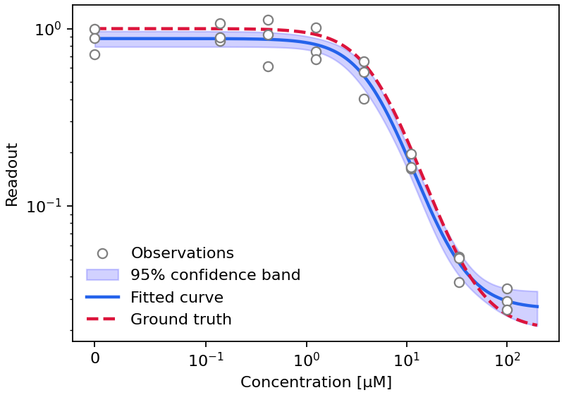

# synfit

Dose–response curve fitting and drug-combination synergy scoring for
pharmacology: Hill models (4- and 5-parameter), explicit noise models, and
Bliss, HSA, Loewe and ZIP references for inhibition and activation assays.

## Install

```bash
pip install synfit
```

Python 3.11 or newer. Pure Python — nothing to compile — on top of NumPy,
SciPy, pandas and Matplotlib.

## Quick start

A single-drug inhibition fit. Data goes in as a tidy DataFrame of
`concentration`, `y` and `replicate`:

```python
import pandas as pd
from synfit import SingleDrugFit

data = pd.DataFrame({
    "concentration": [0, 0.1, 1, 10, 100, 100],
    "y": [1.0, 0.95, 0.75, 0.35, 0.08, 0.05],
    "replicate": [0, 0, 0, 0, 0, 0],
})
result = SingleDrugFit(data).fit()
print(f"c50 (κ): {result.c50:.3g}")
print(f"IC50:    {result.half_max:.3g}")
print(f"Hill:    {result.hill:.3g}")
cis = result.param_ci()
if cis and "c50" in cis:
    lo, hi = cis["c50"]
    print(f"c50 95% CI: [{lo:.3g}, {hi:.3g}]")
```

The half-max concentration is `result.half_max`, reported as IC₅₀ for an
inhibition fit and EC₅₀ for an activation one. `result.to_dict()` gives the
full parameter set, confidence intervals and goodness-of-fit statistics in a
JSON-serialisable form.

## What it does

- **Hill fitting** for single-drug dose–response data, 4-parameter or
  5-parameter (asymmetric), for inhibition and activation assays
- **Drug-drug interaction matrices** — `JointMarginalFit` is the recommended
  marginal path: it fits the two single-agent curves together with shared
  plate-level asymptotes. `MatrixFit` is a diagnostic Bliss-null surface model.
- **Synergy references**: Bliss, HSA, Loewe and ZIP — the last implementing the
  published Zero Interaction Potency model, unit- and direction-neutral
- **Explicit noise models**: constant and heteroscedastic Gaussian, and
  Lognormal, fitted by maximum likelihood rather than assumed
- **Confidence intervals** for each fitted parameter, from the covariance
  estimate at the optimum, where the optimiser produced one
- **Ready-made datasets** with known ground truth, shipped with the package
- **Plots**: dose–response curves and synergy heatmaps via Matplotlib

## Modules

Everything in the table is importable from an installed package. The names in
the first row are also re-exported from the top-level `synfit` namespace.

| Module | Holds |
|---|---|
| `synfit` | `SingleDrugFit`, `MatrixFit`, `FitConfig`, `FitResult`, `hill_curve`, `loewe_ci`, `zip_delta`, … |
| `synfit.hill` | the Hill equation, concentration series, the `log_wall` prior |
| `synfit.single` | single-drug fitters and their default bounds and config |
| `synfit.matrix` | drug-drug matrix fitting |
| `synfit.joint_marginal` | two drugs' curves fitted together, sharing plate-level asymptotes |
| `synfit.noise` | the `NoiseSpec` union, its serialisation and likelihoods |
| `synfit.bliss` | Bliss independence and HSA references |
| `synfit.loewe` | Loewe additivity reference and combination index |
| `synfit.zip` | ZIP reference surface and δ-scores |
| `synfit.synthetic` | data generation, and the scenarios shipped with the package |
| `synfit.plotting` | Matplotlib dose–response curves and heatmaps |

For API details and worked examples, see the
[API reference](https://github.com/szarma/synfit/blob/main/docs/api.md) and
[tutorials](https://github.com/szarma/synfit/blob/main/docs/tutorials.md).

## Datasets included

Twenty scenarios install with the package, so there is data to fit
immediately: clean and noisy single-drug curves, an activation curve, additive
and synergistic matrices, and a Loewe sham — a drug combined with itself, whose
noise-free combination index is 1 wherever it is defined. Each keeps the `config.json` that
generated it, so the true parameters behind every fit are known:

```python
from synfit.synthetic import list_scenarios, scenario_config, scenario_dir

print(list_scenarios())
#  ['matrix_antagonism', 'matrix_asymmetric_potency', 'matrix_independent', ...]

path = scenario_dir("single_drug_clean")
csv = path / "single_drug_clean.csv"           # concentration, y, replicate
truth = scenario_config("single_drug_clean")   # the generating parameters
print(truth["hill_params"]["c50"])
```

Matrix scenarios hold one `rep*.csv` per replicate; single-drug scenarios hold
one tidy CSV. The installed CSVs are fixed within a release, so you can use them
as reproducible fixtures and record `synfit.__version__` with your analysis.

### Fit a bundled synthetic dataset

The bundled scenarios make a compact, reproducible starting point. This one
loads a noisy three-replicate curve and fits it. Its ground truth is available
because the dataset is synthetic; real experimental data does not have one.

```python
# Generates synthetic-fit.png
import pandas as pd
from synfit import FitConfig, SingleDrugFit
from synfit.plotting import dose_response_plot
from synfit.synthetic import scenario_config, scenario_dir

# load dataset (here, one of the synthetic ones)
name = "single_drug_noisy"
directory = scenario_dir(name)
data = pd.read_csv(directory / f"{name}.csv")
truth = scenario_config(name)["hill_params"]

# fit
result = SingleDrugFit(data, FitConfig(noise="lognormal")).fit()

# plot
dose_response_plot(
    data, result, reference=truth, x_label="Concentration [µM]",
)
```



The shaded band is an approximate **confidence interval for the fitted
curve**, derived from the parameter covariance. It is not a prediction interval
for individual observations, and it need not contain the whole true curve in
every experiment. The plotting helper uses a symmetric logarithmic axis when the data
contains a zero-dose control.

For an observed matrix, reference surfaces, and synergy score heatmaps generated
by their accompanying code, see the
[matrix synergy tutorial](https://github.com/szarma/synfit/blob/main/docs/tutorials.md).

## How the fitting works

Fits divide the response by its robust range before optimising and report
everything in your units, so rescaling the data rescales the fit (tested on
responses from about `1e-9` to `1e3`); `scipy.optimize.minimize` (L-BFGS-B)
then runs in scale-relative parameter coordinates. Parameters are bounded through
`FitBounds`: L-BFGS-B enforces box bounds, and the objective also includes a
`log_wall` penalty that is zero inside the bounds and rises linearly outside
them. Variance is profiled out of the likelihood
analytically where the noise model allows it. When a heteroscedastic Gaussian
fit stalls on its first iteration, it is retried once with variance initials
refreshed from the data.

### Noise models

The noise model is part of the fit, configured through `FitConfig.noise` as a
tagged `NoiseSpec` union that serialises to JSON — for example
`{"kind": "gaussian_linear", "a_init": 0.001, "b_init": 0.0}`. The fittable
variants are `GaussianConstant`, `GaussianLinear`, `GaussianQuadratic` and
`Lognormal`.

Constant Gaussian and Lognormal profile their single variance term
analytically. The linear and quadratic Gaussians instead fit coefficients of a
response-dependent variance, σ²(μ) = a + b·d + c·d², where
d = μ − min(effect_0, effect_inf). This anchors the variance at the lower
asymptote when scatter grows with signal. Per-point `y_err` weights remain
available for constant Gaussian and Lognormal fits.

## Synergy references

Each score follows its published definition:

- **ZIP (Zero Interaction Potency)** — Yadav B, Wennerberg K, Aittokallio T, Tang J.
  *Searching for drug synergy in complex dose–response landscapes using an interaction
  potency model.* Computational and Structural Biotechnology Journal 13:504–513 (2015).
  [doi:10.1016/j.csbj.2015.09.001](https://doi.org/10.1016/j.csbj.2015.09.001) —
  the best-known implementation of this method is SynergyFinder. `synfit` implements
  the published formulation for symmetric (4-parameter) curves; for 5-parameter drugs
  it keeps the moving drug's asymmetry in the slice fits, which is an extension of the
  published method and reduces to it when the asymmetry equals 1.

  Tested scope: the δ-scores are checked against fixtures generated by the
  independent [`synergy`](https://pypi.org/project/synergy/) package for two
  dose–response landscapes (one synergistic, one potentiated), agreeing to better
  than `1e-3` in δ units. That is evidence for these cases, not a general proof of
  equivalence to any other implementation.
- **Bliss independence** — Bliss CI. *The toxicity of poisons applied jointly.*
  Annals of Applied Biology 26:585–615 (1939).
- **HSA (Highest Single Agent)** — the combination is compared against whichever
  single agent acts more strongly; see Berenbaum MC. *What is synergy?*
  Pharmacological Reviews 41:93–141 (1989) for the reference frames and how they
  differ. HSA is undefined for an inhibitor combined with an activator.
- **Loewe additivity** — Loewe S, Muischnek H. *Über Kombinationswirkungen.*
  Naunyn-Schmiedeberg's Archiv für experimentelle Pathologie und Pharmakologie
  114:313–326 (1926).

Bliss, HSA and Loewe are checked against `synergy` the same way, on eight
landscapes — additive, synergistic, antagonistic, mismatched slopes, offset
asymptotes, a rectangular grid and an activation case. Bliss, HSA and the
combination index agree to `1e-12`. The Loewe reference agrees to `2e-6`, the
tolerance of the package's own solver, and to `1e-8` with a high-precision
(mpmath) solution. `synergy` 1.0.0 cannot compute a Loewe reference for
activation, so that case is checked against mpmath alone.

### What each function returns

The synergy helpers do not share one sign convention — they return three
different kinds of quantity, so read the units before reading the sign:

| Function | Returns | Synergy is |
|---|---|---|
| `bliss_independence`, `bliss_reference`, `hsa_reference`, `loewe_reference`, `zip_reference` | the **expected response** under that null model, in response units | not a sign — compare against the observed response |
| `zip_fitted_surface` | the fitted ZIP **combination** surface, in response units | not a null model |
| `zip_delta` | a signed δ-score, `-(f_c - f_zip)` in fraction-affected units | **negative** |
| `zip_scores` | `ZipResult`: reference, fitted surface, δ-score, and slice-failure metadata | δ is **negative** for synergy |
| `loewe_ci` | a **combination index**, a dimensionless ratio | **below 1** (1 is additive, above 1 antagonistic) |

The top-level `synfit` namespace exports the reference helpers above.
`synfit.bliss` also exposes `bliss_deviation` and `hsa_deviation`, which return
normalised deviations (negative for synergy); see the
[API reference](https://github.com/szarma/synfit/blob/main/docs/api.md).

## Contributing

See [CONTRIBUTING.md](https://github.com/szarma/synfit/blob/main/CONTRIBUTING.md) for the development setup and the test
and release commands.

## License

MIT — see [LICENSE](https://github.com/szarma/synfit/blob/main/LICENSE).
