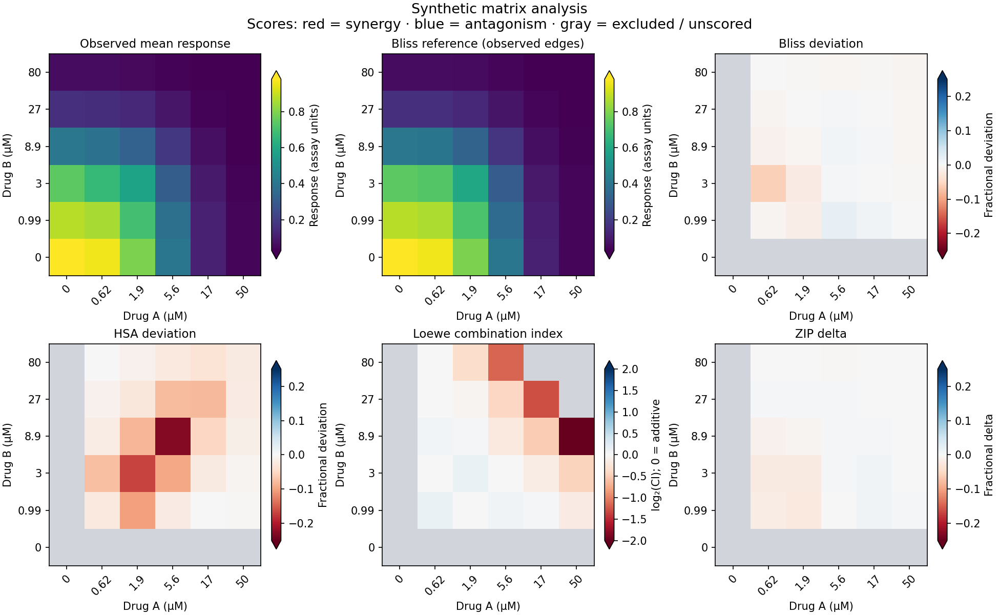

# Tutorials

[README](../README.md) · [API reference](api.md)

These examples run independently after installing synfit. Concentrations must
use one consistent unit per drug; responses must share the assay's signal scale.
The library's plotting helpers return PNG bytes, ready for a notebook display
or a file save. `just generate-doc-figures` saves the matrix figure displayed
below as `docs/images/synergy-analysis.png`.

- [Matrix analysis and synergy heatmaps](#from-a-shipped-matrix-to-interaction-results)
- [Activation, five parameters, bounds and pins](#activation-five-parameters-explicit-bounds-and-pins)
- [Noise models and measurement errors](#choose-noise-or-supply-measurement-errors)
- [Troubleshooting](#troubleshooting-a-fit)

## From a shipped matrix to interaction results

The bundled `matrix_synergy` scenario contains three headerless **tab-separated**
replicate CSVs. Concentrations come from its configuration, not the file headers.
Array rows represent the vertical drug B; columns represent the horizontal drug A.
The zero-dose edges provide each drug's single-agent observations. They are needed
for fitting, but they are not combination scores and are omitted from the figure.

`JointMarginalFit.from_matrix` extracts the single-agent edges and counts their
shared no-drug well once per replicate. Fit the marginal curves, average
replicates for the response surface, then pass the result to `synergy_heatmaps`. The helper
computes Bliss, HSA, Loewe and ZIP and displays their four score surfaces.
`JointMarginalFit` shares physical high/low assay asymptotes while estimating
potency and slope per drug. Sharing is appropriate when both drugs are measured
with the same assay and can reach the same signal limits.

```python
# Generates synergy-analysis.png
import numpy as np
import pandas as pd
from synfit import calculate_concentration_series
from synfit.joint_marginal import JointMarginalFit
from synfit.plotting import synergy_heatmaps
from synfit.synthetic import scenario_config, scenario_dir

cfg = scenario_config("matrix_synergy")
root = scenario_dir("matrix_synergy")
ch = calculate_concentration_series(**cfg["horizontal_drug"]["concentration_series"])
cv = calculate_concentration_series(**cfg["vertical_drug"]["concentration_series"])
replicates = [pd.read_csv(root / f"rep{i}.csv", sep="\t", header=None).to_numpy()
              for i in range(1, cfg["n_replicates"] + 1)]

fit = JointMarginalFit.from_matrix(replicates, ch, cv, noise="lognormal").fit()
assert fit.success, fit.message
mean = np.mean(replicates, axis=0)

synergy_heatmaps(
    mean, ch, cv,
    c50_hor=fit.drug_a.c50, c50_ver=fit.drug_b.c50,
    hill_hor=fit.drug_a.hill, hill_ver=fit.drug_b.hill,
    effect_0=fit.drug_a.effect_0, effect_inf=fit.drug_a.effect_inf,
    x_label="Horizonticlav [µM]",
    y_label="Verticalinib [µM]",
    title="Synthetic matrix synergy scores",
)
```



The configured generating setup uses a potency shift (`synergy_factor=1.5`)
to add inhibition beyond a Bliss reference while preserving the single-agent
edges, then adds lognormal measurement noise. That factor is a simulation
parameter, not an expected value for ZIP delta or Loewe CI. The
Bliss and HSA panels use the observed single-agent edges; Loewe and ZIP use the
fitted marginal curves. Bliss, HSA and ZIP are fractional scores, where
negative means synergy and positive means antagonism, displayed on a fixed
linear color scale from −1 to +1. Loewe CI uses a logarithmic color scale from
0.25 to 4: CI < 1 means synergy, CI = 1 is additive, and CI > 1 means antagonism.
Blue indicates synergy, white the null, and red antagonism. Gray cells are
unscored, never zero interaction. Colorbar extensions mark values beyond the
displayed range.

`MatrixFit` instead fits a six-parameter Bliss null surface to the entire
matrix. It is useful diagnostically, but it can absorb interaction signal into
its fitted parameters. Loewe CI can be NaN for responses outside the invertible
single-agent range; ZIP can be NaN when neither slice fit succeeds. Inspect ZIP
failure metadata before summarizing scores with `nanmean`. Incomplete matrices
need the same scrutiny because observed-edge references cannot reconstruct
missing marginal responses.

## Activation, five parameters, explicit bounds, and pins

Direction names describe how response changes with concentration. They do not
rename the parameters: `effect_0` is always the zero-dose asymptote and
`effect_inf` the high-dose asymptote. A 5p curve adds `asymmetry` to the fitted
parameter list. Its `kappa` (also `c50`) differs from the true `half_max` when
asymmetry is not 1; `to_dict()` reports the latter as `ec50` or `ic50`.

Here the signal limits are known from calibration, so they are pinned. Omit a
Hill parameter from `fitting_parameters` to hold it at its configured value.
Bounds constrain only estimated parameters; a pin is used exactly as supplied.

```python
import numpy as np
import pandas as pd
from synfit import FitBounds, FitConfig, SingleDrugFit, hill_curve
from synfit.plotting import dose_response_plot

rng = np.random.default_rng(17)
conc = np.tile(np.r_[0.0, np.geomspace(0.01, 100, 18)], 3)
y = hill_curve(conc, c50=2, hill=1.3, effect_0=0.1,
               effect_inf=1.2, asymmetry=1.6)
data = pd.DataFrame({"concentration": conc,
                     "y": y + rng.normal(0, 0.015, len(y)),
                     "replicate": np.repeat(np.arange(3), 19)})
config = FitConfig(direction="activation", effect_0=0.1, effect_inf=1.2,
                   log_c50=0.3, hill=1.2, asymmetry=1.4,
                   fitting_parameters=["log_c50", "hill", "asymmetry"],
                   bounds=FitBounds(log_c50=(-2, 2), hill=(0.3, 3),
                                    asymmetry=(0.3, 4)))
result = SingleDrugFit(data, config).fit()
assert result.success, result.message
assert result.effect_0 == 0.1 and result.effect_inf == 1.2
assert result.asymmetry > 0 and result.to_dict()["ec50"] == result.half_max
png = dose_response_plot(data, result)
assert png.startswith(b"\x89PNG\r\n\x1a\n")
print("EC50:", result.half_max, "kappa:", result.kappa)
print("Parameter intervals (possibly unavailable):", result.param_ci())
```

For joint fits, use `model_a="5p"` and/or `model_b="5p"`, and set directions
with `direction_a` / `direction_b`. Their overrides use `param_config`, for
example `{"top": {"init": 1.2, "fit": False}, "hill_a": {"lo": 0.3, "hi": 3}}`.
Shared `top` and `bottom` describe high/low signal, including mixed directions.
This ability to fit mixed directions does not establish that an interaction
reference is meaningful for an inhibitor/activator pair; HSA requires matching
directions.

## Choose noise or supply measurement errors

`SingleDrugFit` and `JointMarginalFit` support `gaussian_constant`,
`gaussian_linear`, `gaussian_quadratic`, and `lognormal`. Constant Gaussian is
useful for additive measurement noise; linear/quadratic Gaussian estimate
response-dependent variance. Lognormal models multiplicative noise and needs
strictly positive included responses and predictions; its variance is constant
in log-response space. Compound additive/multiplicative noise has a low-level
likelihood primitive with supplied scales, but these fitters cannot estimate it.

Pass `noise` to `FitConfig` (or directly to `JointMarginalFit`). Leave bounds
unset for data-derived signal and variance bounds. Explicit signal bounds must
match your response units, including RFU or tiny normalized values.

When measurement standard deviations are known, use `SingleDrugFitWithError`
with a positive finite `y_err` for each included observation. These are standard
deviations on the original response scale, not variances or confidence limits.
This fitter supports constant Gaussian or lognormal noise; lognormal transforms
errors approximately as `y_err / y`. It does not combine supplied errors with
an estimated linear/quadratic variance model.

```python
import numpy as np
import pandas as pd
from synfit import FitConfig, SingleDrugFit, SingleDrugFitWithError, hill_curve

rng = np.random.default_rng(23)
conc = np.tile(np.r_[0.0, np.geomspace(0.02, 50, 16)], 3)
mu = hill_curve(conc, c50=2, hill=1.2, effect_0=1, effect_inf=0.1)
sd = 0.015 + 0.025 * mu
observations = pd.DataFrame({"concentration": conc,
                             "y": mu + rng.normal(size=len(mu)) * sd,
                             "replicate": np.repeat(np.arange(3), 17)})
weighted = observations.assign(y_err=sd)
result = SingleDrugFitWithError(weighted, FitConfig(noise="gaussian_constant")).fit()
assert result.success, result.message
# Alternative: estimate a response-dependent variance from the observations.
linear = SingleDrugFit(observations, FitConfig(noise="gaussian_linear")).fit()
assert linear.success, linear.message
variance = linear.predict_variance(mu)
assert variance is not None and np.all(np.isfinite(variance)) and np.all(variance > 0)
print("Weighted potency:", result.c50, "Estimated variance coefficients:", linear.variance_params)
```

## Troubleshooting a fit

- Check `success` and `message` before interpreting parameters. Optimizer
  success does not guarantee identifiable parameters or a suitable model;
  inspect the plotted curve, dose coverage, and residuals.
- A missing `param_cov` or `param_ci()` returning `None` means uncertainty
  could not be estimated reliably. Even successful fits can have singular
  curvature. Parameters at active bounds have zero covariance rows/columns;
  a degenerate interval there does not establish certainty.
- If potency or slope lands at a bound, check the dose range and initial
  values, then reconsider bounds using assay knowledge. For signal parameters,
  bounds must span the actual response magnitude. Remove unnecessary free
  parameters or gather plateau measurements when the curve is poorly covered.
- Non-finite concentrations/responses are excluded. Single-drug `n_valid` and
  `n_total` report effective observations and input rows. An optional Boolean
  `valids` mask excludes additional observations; preserve its row alignment.
  Included concentrations must be nonnegative, and included `y_err` must be
  positive and finite. Too few effective observations raises `ValueError`.
- Keep replicate observations for marginal fitting. Do not replace missing
  responses with zero: zero is a real measurement and can change both the fit
  and the interaction score. Distinguish a missing cell from a measured
  zero-dose control.
